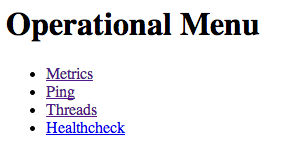
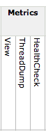
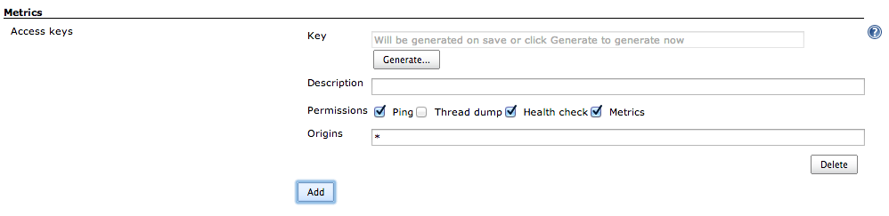

= Metrics plugin for Jenkins

image:https://img.shields.io/jenkins/plugin/v/metrics?label=latest%20release[link=https://plugins.jenkins.io/metrics]
image:https://img.shields.io/github/release-date/jenkinsci/metrics-plugin.svg[link=https://github.com/jenkinsci/metrics-plugin/releases/latest]
image:https://img.shields.io/github/license/jenkinsci/metrics-plugin[link=https://raw.githubusercontent.com/jenkinsci/metrics-plugin/master/LICENSE.md]
image:https://img.shields.io/jenkins/plugin/i/metrics.svg?color=blue[link=https://plugins.jenkins.io/metrics]

This plugin exposes the https://metrics.dropwizard.io/[Metrics] API to Jenkins plugins.

== Configuration

=== Standard health check
The Dropwizard Metrics API includes a contract for health checks.
Health checks return a simple `PASS`/`FAIL` status and can include an optional message.

`disk-space`:: Returns `FAIL` if any of the Jenkins disk space monitors are reporting the disk space as less than the configured threshold.
The message will reference the first node which fails this check.
There may be other nodes that fail the check, but this health check is designed to fail
fast.

`plugins`:: Returns `FAIL` if any of the Jenkins plugins failed to start.
A failure is typically indicative of a potential issue within the Jenkins installation that will either be solved by explicitly disabling the failing plugin(s) or by resolving the corresponding
plugin dependency issues.

`temporary-space`:: Returns `FAIL` if any of the Jenkins temporary space monitors are
reporting the temporary space as less than the configured threshold.
The message will reference the first node which fails this check.
There may be other nodes that fail the check, but this health check is
designed to fail fast.

`thread-deadlock`:: Returns `FAIL` if there are any deadlocked threads in the Jenkins
 JVM.

=== Standard metrics
There are five types of metric defined in the Dropwizard Metrics API:

- A *gauge* is an instantaneous measurement of a value
- A *counter* is a gauge that tracks the count of something
- A *meter* measures the rate of events over time. 
- A *histogram* measures the statistical distribution of values in a stream of data. 
- A *timer* is basically a histogram of the duration of events coupled with a meter of the rate of the event occurrence. 

==== System and Java Virtual Machine metrics
`system.cpu.load` (gauge):: The system load on the Jenkins controller as reported by the JVM's Operating System JMX bean.
_The calculation of system load is operating system dependent._ Typically this is the sum of the number of processes that are currently running plus the number that are waiting to run.
This is typically comparable against the number of CPU cores.

`vm.blocked.count` (gauge):: The number of threads in the Jenkins JVM that are currently blocked waiting for a monitor lock.

`vm.count` (gauge):: The total number of threads in the Jenkins JVM.
This is the sum of: `vm.blocked.count`, `vm.new.count`, `vm.runnable.count`, `vm.terminated.count`, `vm.timed_waiting.count` and `vm.waiting.count`

`vm.cpu.load` (gauge):: The rate of CPU time usage by the JVM per unit time on the Jenkins controller.
This is equivalent to the number of CPU cores being used by the Jenkins JVM.

`vm.daemon.count` (gauge):: The number of threads in the Jenkins JVM that are marked as Daemon threads.

`vm.deadlocks` (gauge):: The number of threads that have a currently detected deadlock with at least one other thread.

`vm.file.descriptor.ratio` (gauge):: The ratio of used to total file descriptors.
(This is a value between `0` and `1` inclusive)

`vm.gc.X.count` (gauge):: The number of times the `X` garbage collector has run.
The `X` names are supplied by and dependent on the JVM.
There will be one metric for each of the garbage collectors reported by the JVM.

`vm.gc.X.time` (gauge):: The amount of time spent in the `X` garbage collector.
The `X` names are supplied by and dependent on the JVM.
There will be one metric for each of the garbage collectors reported by the JVM.

`vm.memory.heap.committed` (gauge):: The amount of memory, in the heap that is used for object allocation, that is guaranteed by the operating system as available for use by the Jenkins JVM.
(Units of measurement: bytes)

`vm.memory.heap.init` (gauge):: The amount of memory, in the heap that is used for object allocation, that the Jenkins JVM initially requested from the operating system.
(Units of measurement: bytes)

`vm.memory.heap.max` (gauge):: The maximum amount of memory, in the heap that is used for object allocation, that the Jenkins JVM is allowed to request from the operating system.
This amount of memory is not guaranteed to be available for memory management if it is greater than the amount of committed memory.
The JVM may fail to allocate memory even if the amount of used memory does not exceed this maximum size.
(Units of measurement: bytes)

`vm.memory.heap.usage` (gauge):: The ratio of `vm.memory.heap.used` to `vm.memory.heap.max`.
(This is a value between `0` and `1` inclusive)

`vm.memory.heap.used` (gauge):: The amount of memory, in the heap that is used for object allocation, that the Jenkins JVM is currently using.(Units of measurement: bytes)

`vm.memory.non-heap.committed` (gauge):: The amount of memory, outside the heap that is used for object allocation, that is guaranteed by the operating system as available for use by the Jenkins JVM.
(Units of measurement: bytes)

`vm.memory.non-heap.init` (gauge):: The amount of memory, outside the heap that is used for object allocation, that the Jenkins JVM initially requested from the operating system.
(Units of measurement: bytes)

`vm.memory.non-heap.max` (gauge):: The maximum amount of memory, outside the heap that is used for object allocation, that the Jenkins JVM is allowed to request from the operating system.
This amount of memory is not guaranteed to be available for memory management if it is greater than the amount of committed memory.
The JVM may fail to allocate memory even if the amount of used memory does not exceed this maximum size.
(Units of measurement: bytes)

`vm.memory.non-heap.usage` (gauge):: The ratio of `vm.memory.non-heap.used` to `vm.memory.non-heap.max`.
(This is a value between `0` and `1` inclusive)

`vm.memory.non-heap.used` (gauge):: The amount of memory, outside the heap that is used for object allocation, that the Jenkins JVM is currently using.
(Units of measurement: bytes)

`vm.memory.pools..usage` (gauge):: The usage level of the `` memory pool, where a value of `0` represents an unused pool while a value of `1` represents a pool that is at capacity.
The `` names are supplied by and dependent on the JVM.
There will be one metric for each of the memory pools reported by the JVM.
`vm.memory.total.committed` (gauge):: The total amount of memory that is guaranteed by the operating system as available for use by the Jenkins JVM.
(Units of measurement: bytes)

`vm.memory.total.init` (gauge):: The total amount of memory that the Jenkins JVM initially requested from the operating system.
(Units of measurement: bytes)

`vm.memory.total.max` (gauge):: The maximum amount of memory that the Jenkins JVM is allowed to request from the operating system.
This amount of memory is not guaranteed to be available for memory management if it is greater than the amount of committed memory.
The JVM may fail to allocate memory even if the amount of used memory does not exceed this maximum size.
(Units of measurement: bytes)

`vm.memory.total.used` (gauge):: The total amount of memory that the Jenkins JVM is currently using.(Units of measurement: bytes)

`vm.new.count` (gauge):: The number of threads in the Jenkins JVM that have not currently started execution.

`vm.runnable.count` (gauge):: The number of threads in the Jenkins JVM that are currently executing in the JVM.
Some of these threads may be waiting for other resources from the operating system such as the processor.

`vm.terminated.count` (gauge):: The number of threads in the Jenkins JVM that have completed execution.

`vm.timed_waiting.count` (gauge):: The number of threads in the Jenkins JVM that have suspended execution for a defined period of time.

`vm.uptime.milliseconds` (gauge):: The number of milliseconds since the Jenkins JVM started

`vm.waiting.count` (gauge):: The number of threads in the Jenkins JVM that are currently waiting on another thread to perform a particular action.

==== Web UI metrics
`http.activeRequests` (counter):: The number of currently active requests against the Jenkins Web UI.
`http.responseCodes.badRequest` (meter):: The rate at which the Jenkins Web UI is responding to requests with a `HTTP/400` status code
`http.responseCodes.created` (meter):: The rate at which the Jenkins Web UI is responding to requests with a `HTTP/201` status code
`http.responseCodes.forbidden` (meter):: The rate at which the Jenkins Web UI is responding to requests with a `HTTP/403` status code
`http.responseCodes.noContent` (meter):: The rate at which the Jenkins Web UI is responding to requests with a `HTTP/204` status code
`http.responseCodes.notFound` (meter):: The rate at which the Jenkins Web UI is responding to requests with a `HTTP/404` status code
`http.responseCodes.notModified` (meter):: The rate at which the Jenkins Web UI is responding to requests with a `HTTP/304` status code
`http.responseCodes.ok` (meter):: The rate at which the Jenkins Web UI is responding to requests with a `HTTP/200` status code
`http.responseCodes.other` (meter):: The rate at which the Jenkins Web UI is responding to requests with a non-informational status code that is not in the list: `HTTP/200`, `HTTP/201`, `HTTP/204`, `HTTP/304`, `HTTP/400`, `HTTP/403`, `HTTP/404`, `HTTP/500`, or `HTTP/503`
`http.responseCodes.serverError` (meter):: The rate at which the Jenkins Web UI is responding to requests with a `HTTP/500` status code
`http.responseCodes.serviceUnavailable` (meter):: The rate at which the Jenkins Web UI is responding to requests with a `HTTP/503` status code
`http.requests` (timer):: The rate at which the Jenkins Web UI is receiving requests and the time spent generating the corresponding responses.

==== Jenkins specific metrics
`jenkins.executor.count.value` (gauge):: The number of executors available to Jenkins.
This is corresponds to the sum of all the executors of all the on-line nodes.
`jenkins.executor.count.history` (histogram):: The historical statistics of `jenkins.executor.count.value`.
`jenkins.executor.free.value` (gauge):: The number of executors available to Jenkins that are not currently in use.
`jenkins.executor.free.history` (histogram):: The historical statistics of `jenkins.executor.free.value`.
`jenkins.executor.in-use.value` (gauge):: The number of executors available to Jenkins that are currently in use.
`jenkins.executor.in-use.history` (histogram):: The historical statistics of `jenkins.executor.in-use.value`.
`jenkins.health-check.count` (gauge):: The number of health checks associated with the HealthCheckRegistry defined within the Metrics Plugin
`jenkins.health-check.duration` (timer):: The rate at which the health checks are being run and the duration of each health check run.
The Metrics Plugin, by default, will run the health checks once per minute.
The frequency can be controlled by the `jenkins.metrics.api.Metrics.HEALTH_CHECK_INTERVAL_MINS` system property.
In addition, the Metrics Plugin's Operational Servlet can be used to request the health checks be run on demand.

`jenkins.health-check.inverse-score` (gauge):: The ratio of health checks reporting failure to the total number of health checks.
Larger values indicate decreasing health as measured by the health checks.
(This is a value between `0` and `1` inclusive)
`jenkins.health-check.score` (gauge):: The ratio of health checks reporting success to the total number of health checks.
Larger values indicate increasing health as measured by the health checks.
(This is a value between `0` and `1` inclusive)
`jenkins.job.blocked.duration` (timer):: The rate at which jobs in the build queue enter the blocked state and the amount of time they spend in that state.
`jenkins.job.buildable.duration` (timer):: The rate at which jobs in the build queue enter the buildable state and the amount of time they spend in that state.
`jenkins.job.building.duration` (timer):: The rate at which jobs are built and the time they spend building.
`jenkins.job.queuing.duration` (timer):: The rate at which jobs are queued and the total time they spend in the build queue.
`jenkins.job.total.duration` (timer):: The rate at which jobs are queued and the total time they spend from entering the build queue to completing building
`jenkins.job.waiting.duration` (timer):: The rate at which jobs enter the quiet period and the total amount of time that jobs spend in their quiet period.
Jenkins allows configuring a quiet period for most job types.
While in the quiet period multiple identical requests for building the job will be coalesced.
Traditionally this was used with source control systems that do not provide an atomic commit facility - such as CVS - in order to ensure that all the files in a large commit were picked up as a single build.
With more modern source control systems the quiet period can still be useful, for example to ensure that push notification of the same commit via redundant parallel notification paths get coalesced.
`jenkins.job.count.value` (gauge):: The number of jobs in Jenkins
`jenkins.job.count.history` (histogram):: The historical statistics of `jenkins.job.count.value`.
`jenkins.job.scheduled` (meter):: The rate at which jobs are scheduled.
If a job is already in the queue and an identical request for scheduling the job is received then Jenkins will coalesce the two requests.
This metric gives a reasonably pure measure of the load requirements of the Jenkins controller as it is unaffected by the number of executors available to the system.
Multiplying this metric by `jenkins.job.building.duration` gives an approximate measure of the number of executors required in order to ensure that every build request results in a build.
A more accurate measure can be obtained from a job-by-job summation of the scheduling rate for that job and the average build duration of that job.The most accurate measure would require maintaining separate sums partitioned by the labels that each job can run against in order to determine the number of each type of executor required.
Such calculations assume that: every build node is equivalent and/or the build times are comparable across all build nodes; and build times are unaffected by other jobs running in parallel on other executors on the same node.
However in most cases even the basic result from multiplying `jenkins.job.scheduled` by `jenkins.job.building.duration` gives a reasonable result.
Where larger than `jenkins.executor.count.value` by more than 10-15% the Jenkins build queue is typically observed to grow rapidly until most jobs have at least one build request sitting in the build queue.
Whereas when less than `jenkins.executor.count.value` by at least 20-25% the build queue will tend to remain small, except for those cases where there are a large number of build jobs fighting for a small number of executors on nodes with specific labels.

`jenkins.node.count.value` (gauge):: The number of build nodes available to Jenkins, both on-line and off-line.

`jenkins.node.count.history` (histogram):: The historical statistics of `jenkins.node.count.value`.

`jenkins.node._XXX.builds` _(timer):: The rate of builds starting on the `_XXX_` node and the amount of time they spend building.
There will be one metric for each `_XXX_` named node.
The metric is lazily created after the JVM starts up when the first build starts on that node.

`jenkins.node.offline.value` (gauge):: The number of build nodes available to Jenkins but currently off-line.

`jenkins.node.offline.history` (histogram):: The historical statistics of `jenkins.node.offline.value`.

`jenkins.node.online.value` (gauge):: The number of build nodes available to Jenkins and currently on-line.

`jenkins.node.online.history` (histogram):: The historical statistics of `jenkins.node.online.value`.

`jenkins.plugins.active` (gauge):: The number of plugins in the Jenkins instance that started successfully.

`jenkins.plugins.failed` (gauge):: The number of plugins in the Jenkins instance that failed to start.
A value other than `0` is typically indicative of a potential issue within the Jenkins installation that will either be solved by explicitly disabling the plugin(s) or by resolving the plugin dependency issues.

`jenkins.plugins.inactive` (gauge):: The number of plugins in the Jenkins instance that are not currently enabled.

`jenkins.plugins.withUpdate` (gauge):: The number of plugins in the Jenkins instance that have an newer version reported as available in the current Jenkins update center metadata held by Jenkins.
This value is not indicative of an issue with Jenkins but high values can be used as a trigger to review the plugins with updates with a view to seeing whether those updates potentially contain fixes for issues that could be affecting your Jenkins instance.

`jenkins.queue.blocked.value` (gauge):: The number of jobs that are in the Jenkins build queue and currently in the blocked state.

`jenkins.queue.blocked.history` (histogram):: The historical statistics of `jenkins.queue.blocked.value`.

`jenkins.queue.buildable.value` (gauge):: The number of jobs that are in the Jenkins build queue and currently in the buildable state.

`jenkins.queue.buildable.history` (histogram):: The historical statistics of `jenkins.queue.buildable.value`.

`jenkins.queue.pending.value` (gauge):: The number of jobs that are in the Jenkins build queue and currently in the pending state.

`jenkins.queue.pending.history` (histogram):: The historical statistics of `jenkins.queue.pending.value`.

`jenkins.queue.size.value` (gauge):: The number of jobs that are in the Jenkins build queue.

`jenkins.queue.size.history` (histogram):: The historical statistics of `jenkins.queue.size.value`.

`jenkins.queue.stuck.value` (gauge):: The number of jobs that are in the Jenkins build queue and currently in the stuck state.

`jenkins.queue.stuck.history` (histogram):: The historical statistics of `jenkins.queue.stuck.value`.

=== Dropwizard Operational Menu Servlet
There is a very basic set of standard servlets provided by Dropwizard in conjunction with an Operational menu.

The Metrics servlet returns the Metrics in JSON format (There is also support for JSONP format by requesting `Content-Type: text/javascript`).

The Ping servlet returns the text "pong" and a `HTTP/200` status code.

The Threads servlet returns a thread dump from the controller only.

The Healthcheck servlet runs the healthchecks defined against the Metrics API and returns the detailed status in `JSON` (or `JSONP`) format, while the high level status is reported by the HTTP status code.

These servlets are protected by security controls in order to ensure that they are not abused.

=== User access
Authenticated users can access the Dropwizard Metrics Servlet at `$JENKINS_URL/metrics/currentUser/`` if they have the Metrics/View permission.

Access to the Thread Dumps and Health Checks are given a finer-grained control using the Metrics/ThreadDump and Metrics/HealthCheck permissions respectively.

This is because thread dumps and health checks may expose information about job names or build nodes which may be against organization security policies.

=== Machine access
Access to the Metrics Servlet can also be provided by issuing API keys.
API keys can be configured from the Jenkins global configuration screen (`$JENKINS_URL/configure`) under the “Metrics” section.
Multiple access can be generated and permissions associated with those keys can also be restricted at this level.

Alternatively, Metrics can be restricted to users with a specified access key to the metrics.
This configuration can be set up using the Jenkins global configuration screen (`$JENKINS_URL/configure`) under the “Metrics” section.
Multiple access can be generated, and access keys’ permissions can be restricted at this level.

Each API key can be configured with unique permissions for the four servlets that the Dropwizard Metrics Servlet offers and each API key can be configured with its own CORS supported origins.

- `HTTP GET` requests are using the base URL `$JENKINS_URL/metrics/$KEY/`
- `HTTP POST` requests are using the base URL `$JENKINS_URL/metrics/` with the key provided by a standard URL encoded form parameter called key
